# UIDAI Data Hackathon 2026  
**Data-Driven Insights into Aadhaar Lifecycle Management**  
Author: Rahul Chandra Padamuttam  
Institution: National Institute of Advanced Manufacturing Technology (NIAMT)  

---

## Overview
This repository contains my project submission for the UIDAI Data Hackathon 2026.  
The work analyzes Aadhaar lifecycle data across enrolment, demographic updates, and biometric updates to identify trends, anomalies, and operational gaps.  
The project demonstrates skills in data cleaning, feature engineering, anomaly detection, and visualization.

---

## Problem Statement
The Aadhaar lifecycle involves multiple stages: enrolment, demographic updates, and biometric updates.  
Drop-offs at any stage can lead to incomplete lifecycle progression.  
This project integrates datasets across all stages to detect anomalies and highlight operational bottlenecks.

---

## Methodology
1. **Data Cleaning** – Standardized column names, converted dates, handled missing values.  
2. **Data Merging** – Combined enrolment, demographic, and biometric datasets into master files.  
3. **Feature Engineering** – Calculated ratios (adult vs youth), created lifecycle completeness flags.  
4. **Aggregation** – Summarized data at state and district levels.  
5. **Anomaly Detection** – Ratio-based methods to identify districts with disproportionate adult updates.  
6. **Visualization** – Bar charts, heatmaps, scatter plots, funnel charts, and correlation matrices.  
7. **Insight Extraction** – Highlighted national trends, state-level highlights, and anomalies.

---

## Visualizations

### Enrolment Analysis
- **Age Distribution**  
  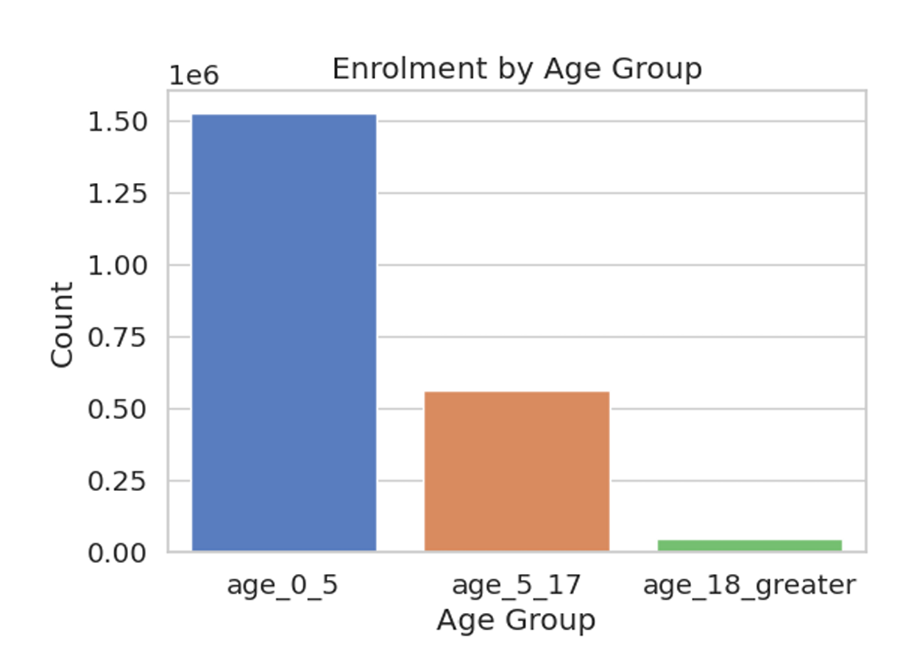  
- **Top States**  
  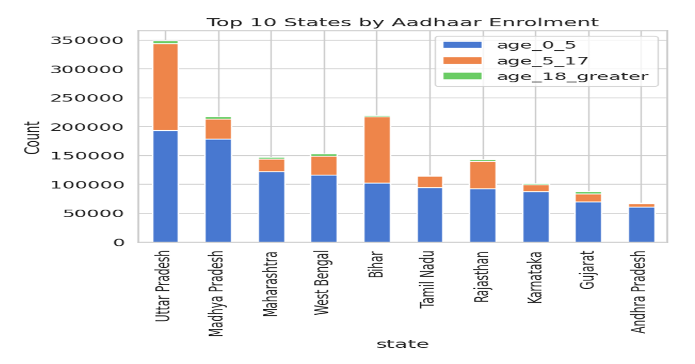  
- **District Heatmap**  
  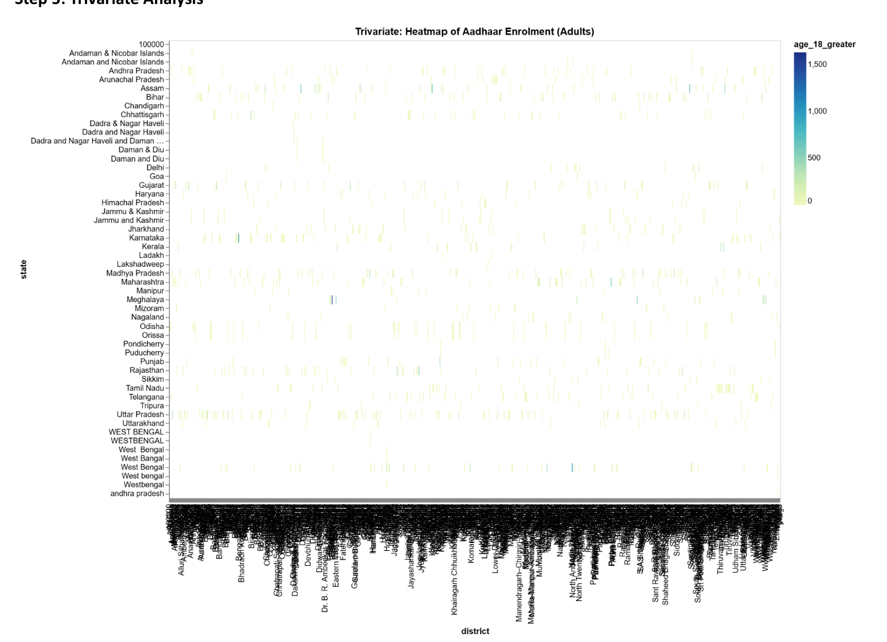  
- **Anomalies**  
  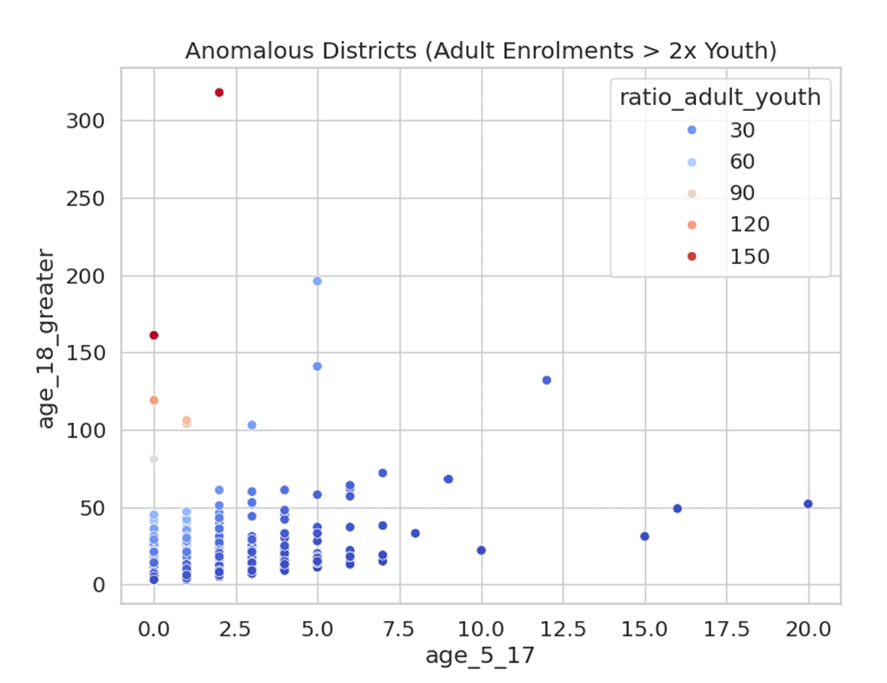  

### Demographic Analysis
- **Age Distribution**  
  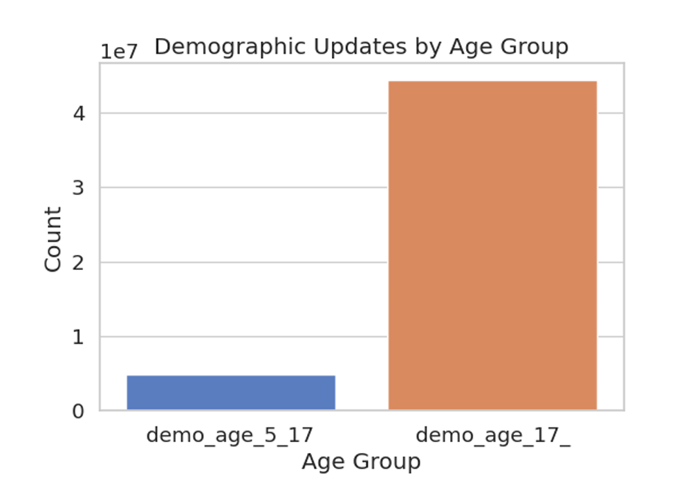  
- **Top States**  
  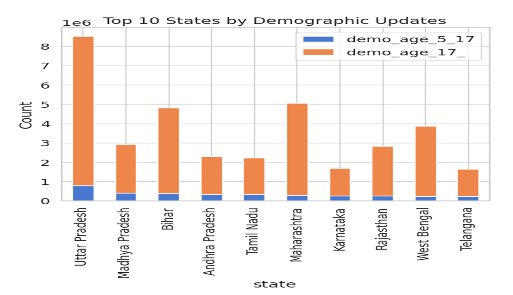  
- **District Heatmap**  
  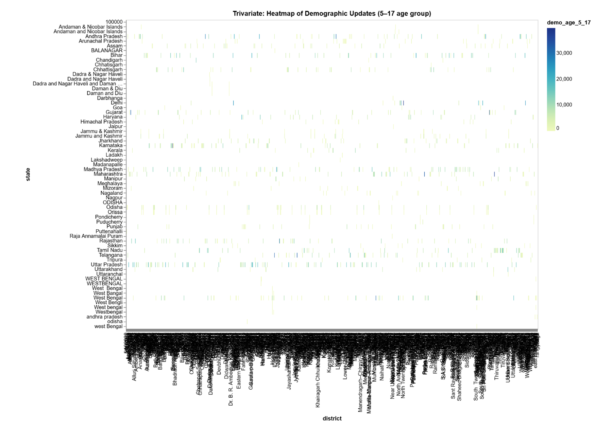  
- **Anomalies**  
  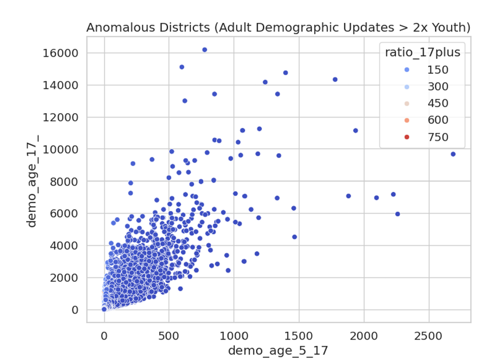  

### Biometric Analysis
- **Age Distribution**  
  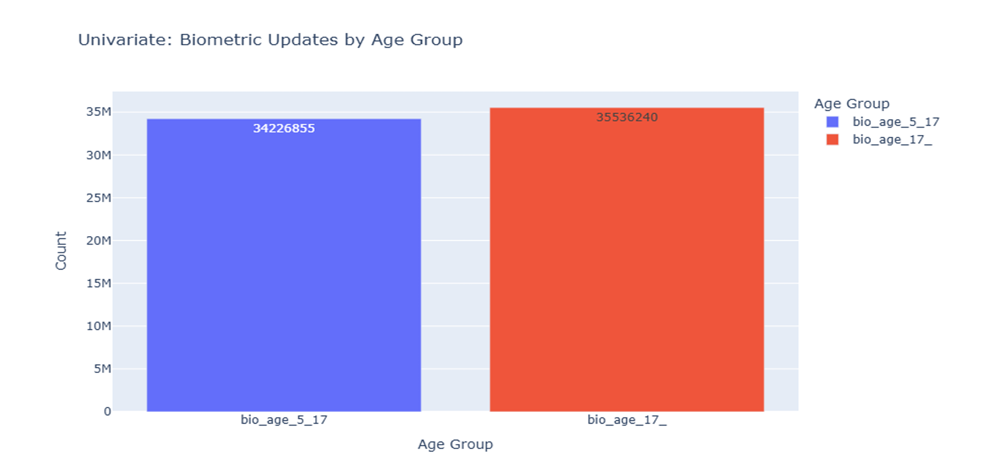  
- **Top States**  
  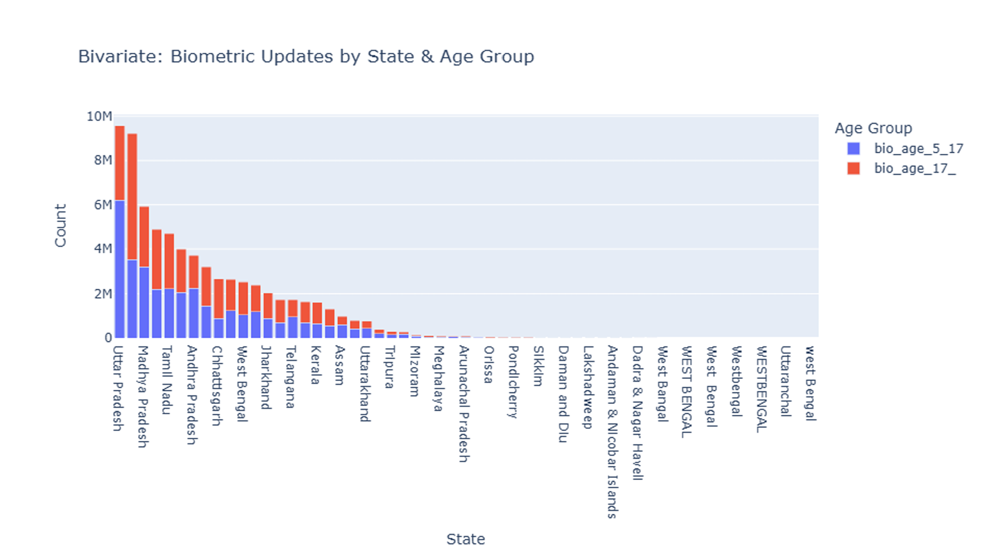  
- **District Heatmap**  
  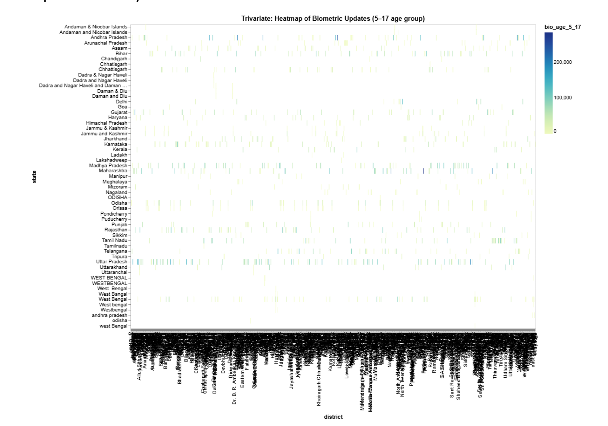  
- **Anomalies**  
  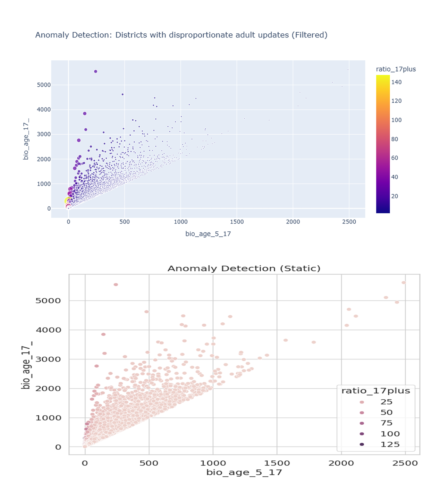  

### Lifecycle Integration
- **Youth State Progression**  
  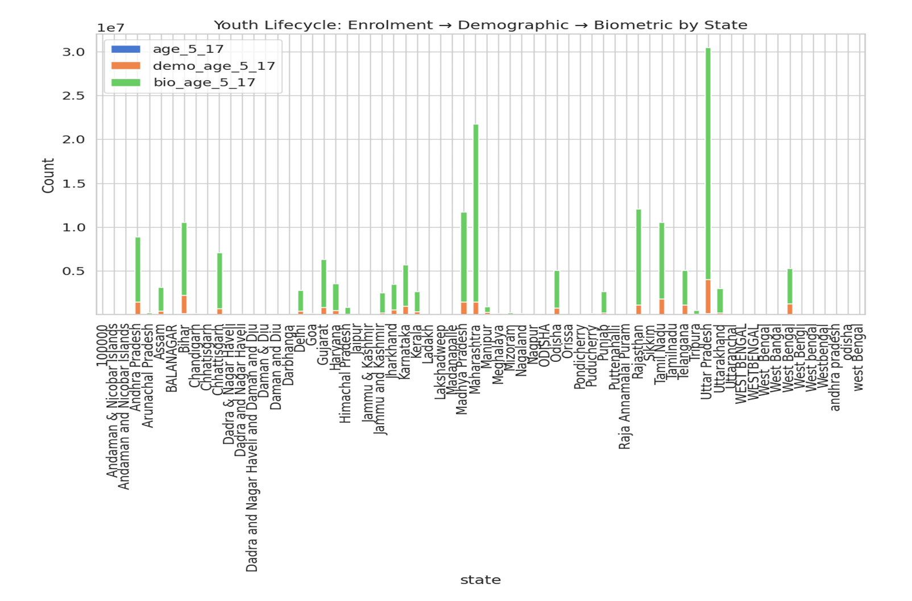  
- **Correlation Matrix**  
  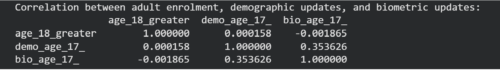  
- **Funnel Chart**  
  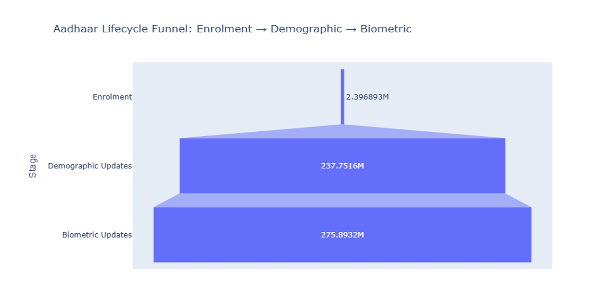  

---

## Key Insights
- Youth biometric updates (~34M) and adult biometric updates (~35M) are nearly balanced.  
- Adult demographic updates (~44M) far exceed youth (~4.8M), suggesting stronger focus on adult corrections.  
- Infant enrolments dominate nationally, reflecting strong early-age coverage drives.  
- Uttar Pradesh leads in youth enrolments and demographic updates.  
- Maharashtra tops adult biometric updates.  
- Over 300K districts show adult updates more than double youth updates, indicating operational bottlenecks.

---

## Recommendations
- **Normalize Data Pipelines** – Standardize state/district naming conventions.  
- **Targeted Awareness Campaigns** – Focus on districts with lagging youth updates.  
- **Lifecycle Completion Monitoring** – Use funnel charts to track drop-offs.  
- **District-Level Dashboards** – Enable real-time anomaly detection.  
- **Operational Efficiency** – Investigate districts with unusually high adult update ratios.

---

## How to Run
1. Clone the repository.  
2. Install dependencies:  
   ```bash
   pip install -r requirements.txt
   ```bash
3. Open notebooks in Jupyter or Google Colab.
4. Run analyses to reproduce visualizations.


## Note on Data Privacy
Datasets used in this project were provided by UIDAI during the hackathon.
Raw datasets and output CSVs are not shared in this repository.
All visualizations are based on aggregated, anonymized data.

## Acknowledgements
UIDAI for organizing the hackathon.
